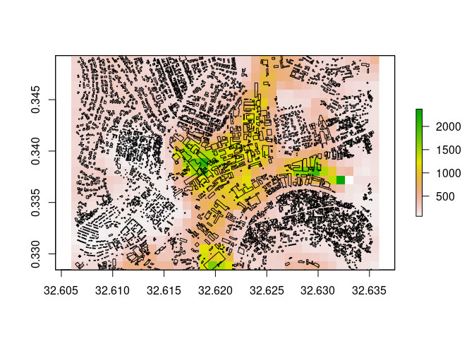

<!-- README.md is generated from README.Rmd. Please edit that file -->

# foot: An R package for processing building footprints

*[WorldPop Research Group, University of
Southampton](https://www.worldpop.org/)*

While remote sensing has long been used to monitor urbanisation
patterns, in recent years there has been an increasing availability in
finer resolution satellite data covering large areas of the globe. This
very high resolution imagery (often \<1 m spatial resolution), combined
with increased computing power is producing new datasets on urban areas.
In particular, machine learning algorithms are being applied to detect,
automatically extract, and map full sets of building features in a
scene. These automated methods add to the manually digitised information
such as from [OpenStreetMap](http://www.openstreetmap.org) and the
property datasets available from some city governments.

Such building footprint datasets provide a new level of detail on urban
areas, particularly in places which might otherwise lack detailed maps
on cities and rapidly growing areas. Despite their spatial detail,
building footprints typically lack any other attribute information to
help differentiate land uses or other neighbourhood characteristics.
However, the size, shape, orientation, and clustering of structures
produces a spatial pattern that can suggest areas of different land use
or activities.

The `foot` package is designed to provide a set of consistent and
flexible tools for processing 2D vector representations of buildings and
calculating urban morphology measurements. The functionality includes
basic geometry and morphology measures, distance and clustering metrics.
These calculations are supported with helper functions for spatial
intersections and tiled reading/writing of data.

## Installation

The `foot` package can be installed directly from Github.

``` r
devtools::install_github("wpgp/foot", build_vignettes=TRUE)
```

Note that building and running the code may require additional packages:
`stars`, `raster`, `sf`, `data.table`, `lwgeom`, `mmap`. et al.

## Quick Start

A sample dataset of building footprints is provided:

    # load the sample
    data("kampala", package="foot")
    
    # 2D vector building polygons
    kampala$buildings

### Vignettes

Vignettes are provided as an introduction to `foot`. The vignette on
basic usage is available from `vignette("footsteps", package="foot")`.
The supplied datasets can be used to replicate this vignette. For a
discussion and example of creating gridded data layers, see
`vignette("bigfoot", package="foot")`. Finally, techniques for using
custom morphology metric functions with `foot` is demonstrated in
`vignette("cobbler", package="foot")`. These vignettes are also
available from this package website.

### Basic Usage

``` r
library(foot)

# load sample data
data("kampala", package="foot")
buildings <- kampala$buildings
zones <- kampala$adminZones
grid <- kampala$mastergrid
```

The `foot` package provides tools to calculate and summarise building
morphology measures at multiple scales. These include building-level
geometry measures.

``` r
# building-level metrics
buildings$built_area <- calculate_footstats(buildings, what="area")
#> Selecting metrics 
#> Setting control values. 
#> Pre-calculating areas 
#> No summary functions found, returning metrics.
  head(buildings)
#> Simple feature collection with 6 features and 2 fields
#> geometry type:  POLYGON
#> dimension:      XY
#> bbox:           xmin: 32.60765 ymin: 0.341117 xmax: 32.61288 ymax: 0.345773
#> geographic CRS: WGS 84
#>   FID_1                       geometry            area
#> 1   130 POLYGON ((32.61282 0.341132...  22.00824 [m^2]
#> 2   132 POLYGON ((32.61229 0.341693... 220.39011 [m^2]
#> 3   133 POLYGON ((32.60817 0.342753...  38.95750 [m^2]
#> 4   135 POLYGON ((32.60808 0.343578... 386.74429 [m^2]
#> 5   137 POLYGON ((32.60786 0.344552... 349.57765 [m^2]
#> 6   138 POLYGON ((32.60765 0.345604... 164.00931 [m^2]
```

As well as area-level summaries within spatial zones.

``` r
# Area-level summary metrics
# Optionally, create an index for the buildings to zones
building_zone <- zonalIndex(buildings, 
                            zones, 
                            zoneField = "Id", 
                            returnObject = TRUE)

# summarise metrics within small areal units
admin_area <- calculate_footstats(building_zone, 
                                  zone="Id", 
                                  what="area", how="mean")
#> Selecting metrics 
#> Setting control values. 
#> Creating zonal index 
#> Pre-calculating areas 
#> 
#> Calculating  1  metrics ... 
#>    area mean  
#> Finished calculating metrics.
  head(admin_area)
#>    Id       area_mean
#> 1:  1  402.5984 [m^2]
#> 2:  2  211.0534 [m^2]
#> 3:  3  525.0747 [m^2]
#> 4:  4  555.0931 [m^2]
#> 5:  5  568.7154 [m^2]
#> 6:  6 1021.9529 [m^2]
```

Or gridded summary outputs, with the options to include a circular focal
window.

``` r
# calculated along a raster within a circular focal window
gridded <- calculate_bigfoot(buildings, 
                             what="area", how="mean",
                             focalRadius=200,
                             template=grid,
                             outputPath=tempdir())
#> Selecting metrics 
#> Setting control values. 
#> Creating template output grids 
#> Creating list of processing tiles 
#> Setting up cluster...
#> Begin parallel tile processing: 2020-10-21 16:14:52
#> 
#> Finished processing all tiles: 2020-10-21 16:14:56

  raster::plot(raster::raster(gridded))
  plot(sf::st_geometry(buildings), add=TRUE)
```



### Outputs

Rasters in GeoTiff format or data tables:

1.  Binary settlement indicators
2.  Counts of structures
3.  Building area
4.  Building perimeter
5.  Nearest neighbour distance
6.  Nearest neighbour index
7.  Structure orientation angle (normalised entropy)
8.  Compactness (Polsby-Popper)
9.  Roundness

A full list of characteristics and summary function names can be
retrieved with `foot::list_fs()`.

## Contributions

Contributions are welcome. Raise or respond to an issue, or create a new
branch to develop a feature/modification and submit a pull request.

## Acknowledgements

``` r
citation("foot")
#> 
#> To cite package 'foot' in publications use:
#> 
#>   WorldPop Research Group, University of Southampton (2020). foot: An R package for processing building footprints morphometrics. R package version 0.5.
#>   https://github.com/wpgp/foot
#> 
#> A BibTeX entry for LaTeX users is
#> 
#>   @Manual{,
#>     title = {foot: An R package for processing building footprints morphometrics},
#>     author = {{WorldPop Research Group, University of Southampton}},
#>     year = {2020},
#>     note = {R package version 0.5},
#>     url = {https://github.com/wpgp/foot},
#>   }
```

This work was undertaken by members of the WorldPop Research Group at
the University of Southampton (Chris Jochem, Edith Darín, Claire Dooley,
Doug Leasure) with support from Andy Tatem and Attila Lazar. Funding
support comes from the Bill and Melinda Gates Foundation and the United
Kingdom Foreign, Commonwealth & Development Office as part of the
Geo-Referenced Infrastructure and Demographic Data for Development
project (GRID3) (OPP1182408). Project partners in
[GRID3](https://grid3.org/) include the WorldPop Research Group, the
United Nations Population Fund, the Flowminder Foundation, and the
Center for International Earth Science Information Network within the
Earth Institute at Columbia University.
