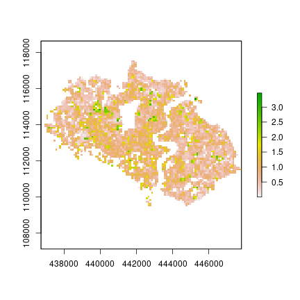
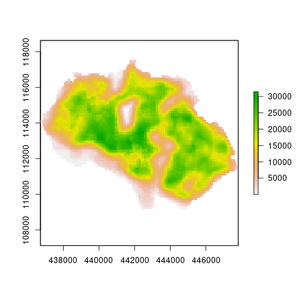

The `foot` package was developed by WorldPop at the University of Southampton
([www.worldpop.org](https://www.worldpop.org)) to support geometric calculations
and zonal summaries of measures from building footprint polygons. The
`vignette(footsteps)` provides an introduction to package and the functionality
of calculating and summarising morphology measures. This vignette builds on
those methods and demonstrates a more advanced workflow to produce gridded
summaries of buildings measures and how to handle large data sets.

This vignette use a portion of Ordnance Survey's OS OpenMap Local data of
building footprint polygons. The polygons cover the area of Southampton. These
data were originally processed and made available by Alasdair Rae
([http://ajrae.staff.shef.ac.uk/buildings/](http://ajrae.staff.shef.ac.uk/buildings/))
under the [OS OpenData License](http://os.uk/opendata/licence). The data contain
Ordnance Survey data © Crown copyright and database right 2018.


```r
library(foot)
```

## Calculations with `foot`
The central function for producing gridded layers is `calculate_bigfoot`. It is
designed to support processing large sets of building polygons into gridded
(GeoTiff) summary layers. The procedure is intended to be more memory-efficient
by splitting the processing area into "tiles" which can then be handled
individually or in parallel. This function works as a wrapper to
`calculate_footstats` as well as several helper functions within the `foot`
package for managing the input/output and creating and indexing spatial zones.

By default the function performs calculations in parallel (which can be changed
with the argument `parallel=FALSE`). To monitor the supplied values and
processing steps, set `verbose=TRUE`.

### Main inputs
Users need to supply:

* A path to a file of building footprints in a spatial vector data format (e.g.
`.gpkg`, `.shp`)
* A filepath to a template gridded dataset specifying the extent and resolution
for the outputs (e.g. `.tif`)

For example.

```r
# local file paths for demonstration
dir <- "/home/jochem/Documents/projects/0_data"
bldgPath <- file.path(dir, "soton_buildings.gpkg")
sotonGrid <- file.path(dir, "soton_borough_100m.tif")
```

While `R` objects can be supplied for these parameters, it is recommended to
supply character strings of paths to the files. `calculate_bigfoot` will only
read the subset of data needed for a particular processing step. This is
intended to allow users to process much larger datasets than can be held in
memory.

### Basic calculations
With the key inputs for the file paths set, the processing can be executed with
a single function.


```r
# basic function call with default parameters
calculate_bigfoot(X = bldgPath, template = sotonGrid, metrics = "settled", verbose = TRUE)
#> Setting up cluster
#> Begin parallel tile processing 
#> 
#> Finished processing all tiles: 2020-06-11 14:52:55
```

### Specifying outputs
By default the outputs of `bigfoot` are saved as GeoTiffs in `R`'s `tempdir()`
which is changed for each session. Each grid is named by the short name of
the calculated metric.


```r
# retrieve the gridded output
outGrid <- raster::raster(file.path(tempdir(), "settled.tif"))

raster::plot(outGrid)
```


Users can specify an output path to another folder location. Additionally a
"tag" can be specified as a parameter to the function. The tag is appended to
the beginning of each file name. This can be useful for identifying different
outputs.

### Multiple metrics
As with `calculate_footstats` multiple metrics and summary statistics can be
supplied to `bigfoot` as a vector of strings. The list of metrics is available
in `foot::fs_footprint_metrics` or it can be retrieved with several look-up
functions (see `?get_fs_metrics`).


```r
# re-running the basic call
calculate_bigfoot(X=bldgPath,
                  metrics=c("settled","area_cv"),  # multiple metrics
                  template=sotonGrid, 
                  outputPath=tempdir(),  # output folder location as a string
                  outputTag="soton")  # filename tag
```

```r
# retrieve the gridded outputs must add the 'tag' to the filename
outGrid <- raster::raster(file.path(tempdir(), "soton_area_cv.tif"))

raster::plot(outGrid)
```



### Focal window statistics
In the examples above, the footprint statistics are summarised for buildings
which intersect the pixels of the template grid. Internally this is handled by
`zonalIndex()`. However, it is also possible to calculate and summarise building
features within a local, circular window. The output is still associated with
each template grid cell, similar to a moving window analysis. The focal radius
distance is always specified in meters.


```r
# moving focal window calculations
calculate_bigfoot(X=bldgPath,
                  metrics=c("settled",
                            "area_mean",
                            "perim_total"),
                  focalRadius=300,  # buffer radius in meters
                  template=sotonGrid, 
                  outputPath=tempdir(), 
                  outputTag="soton")
```

Note that when a focal radius is specified, this value is always appended to the
end of the file names so that the output can be identified.

```r
# note that the filename includes both a tag and a focal radius value
outGrid <- raster::raster(file.path(tempdir(), "soton_perim_total_300.tif"))

raster::plot(outGrid)
```




## Options and finer control
The `calculate_bigfoot` function is set up with default values that should work
under most conditions; however, there is additional flexibility for users to
specify alternative parameters. 

### Specifying geometry units
To override the default units used in the geometry calculations, a named list of
unit strings can be supplied to the `controlUnits` argument. This list can
contain named items for `areaUnit`, `perimUnit`, and `distUnit`. The value of
each item should be coercible with `units::as_units`.


```r
# change the default units used to calculate area and distance
calculate_bigfoot(X=bldgPath,
                  metrics=c("area_mean",
                            "perim_total"),  
                  controlUnits=list(areaUnit="m^2",  # change default units
                                    perimUnit="km"),
                  template=sotonGrid, 
                  outputPath=tempdir(),  
                  outputTag="soton",
                  parallel=FALSE,
                  verbose=TRUE)  
#> 
#> Tile: 1 of 1
#> Reading layer `soton_buildings' from data source `/home/jochem/Documents/projects/0_data/soton_buildings.gpkg' using driver `GPKG'
#> Simple feature collection with 31289 features and 10 fields
#> geometry type:  MULTIPOLYGON
#> dimension:      XYZ
#> bbox:           xmin: 436985.8 ymin: 109485.5 xmax: 447734.5 ymax: 117564.1
#> z_range:        zmin: 0 zmax: 0
#> projected CRS:  OSGB 1936 / British National Grid
#> Warning in st_cast.sf(Xsub, "POLYGON"): repeating attributes for all sub-geometries for which they may not be constant
#> Pre-calculating footprint areas 
#> Pre-calculating footprint perimeters
#> Linking to GEOS 3.8.0, GDAL 3.0.4, PROJ 6.3.1
#> WARNING: different compile-time and runtime versions for GEOS found:
#> Linked against: 3.8.0-CAPI-1.13.1  compiled against: 3.8.1-CAPI-1.13.3
#> It is probably a good idea to reinstall sf, and maybe rgeos and rgdal too
#> Generating zonal index 
#> Creating index 
#> Selectinig metrics 
#> 
#> Calculating  2  metrics ... 
#>    fs_area_mean  
#>    fs_perim_total  
#> Finished calculating metrics. 
#> Writing output tiles 
#> Finished writing grids
#> 
#> Finished processing all tiles: 2020-06-11 14:53:27

# plot the total perimeter, measured in kilometres
outGrid <- raster::raster(file.path(tempdir(), "soton_perim_total.tif"))
raster::plot(outGrid)
```


In the above example, note that the units for the nearest neighbour distance
were not specified in the `controlUnits` list. The default value was still used.

### Filtering buildings
In some settings it may be preferable to exclude very small and/or very large
building footprint polygons. The lower and upper bounds for filtering can be
specified with `minArea` and `maxArea` arguments. The values for these filters
are in the same units specified by `controlUnits` or the default value for area
calculations. Note that an "area" footprint statistic does not need to be
requested.


```r
calculate_bigfoot(X=bldgPath,
                  metrics=c("shape_mean",
                            "count",
                            "perim_total"),  
                  controlUnits=list(areaUnit="m^2"),
                  minArea=50,  # footprints must be larger than 50 m^2
                  maxArea=1000,  # footprints must be smaller than 1000 m^2
                  template=sotonGrid, 
                  outputPath=tempdir(),  
                  outputTag="soton",
                  parallel=FALSE,
                  verbose=TRUE)  
#> 
#> Tile: 1 of 1
#> Reading layer `soton_buildings' from data source `/home/jochem/Documents/projects/0_data/soton_buildings.gpkg' using driver `GPKG'
#> Simple feature collection with 31289 features and 10 fields
#> geometry type:  MULTIPOLYGON
#> dimension:      XYZ
#> bbox:           xmin: 436985.8 ymin: 109485.5 xmax: 447734.5 ymax: 117564.1
#> z_range:        zmin: 0 zmax: 0
#> projected CRS:  OSGB 1936 / British National Grid
#> Warning in st_cast.sf(Xsub, "POLYGON"): repeating attributes for all sub-geometries for which they may not be constant
#> Pre-calculating footprint areas 
#> Pre-calculating footprint perimeters 
#> Filtering features larger than 50 
#> Filtering features smaller than 1000 
#> Generating zonal index 
#> Creating index 
#> Selectinig metrics 
#> 
#> Calculating  3  metrics ... 
#>    fs_count  
#>    fs_perim_total  
#>    fs_shape_mean  
#> Finished calculating metrics. 
#> Writing output tiles 
#> Finished writing grids
#> 
#> Finished processing all tiles: 2020-06-11 14:53:56
```

In the map of the results, note the much smaller number of structures in pixels
around the central business districts and southwestern edge of the study region.

```r
outGrid <- raster::raster(file.path(tempdir(), "soton_count.tif"))

raster::plot(outGrid)
```


### Tile size
The size of the processing tiles, specified in pixel dimensions (rows, columns)
can be an important factor in the efficiency of the calculations. Smaller tile
regions result in fewer building footprints being read/processed at one time,
but there is an overhead computational cost of reading/writing files. The
default value is 500 pixels. For the small demonstration shown here that results
in one tile for the whole region. To show multiple tile processing, a small size
is supplied and the processing is done in parallel with verbose output.


```r
calculate_bigfoot(X=bldgPath,
                  template=sotonGrid,
                  metrics=c("settled","compact_mean"),
                  tileSize=c(100, 75),  # rows x columns in pixels
                  parallel=FALSE,
                  verbose=TRUE)
#> 
#> Tile: 1 of 2
#> Reading layer `soton_buildings' from data source `/home/jochem/Documents/projects/0_data/soton_buildings.gpkg' using driver `GPKG'
#> Simple feature collection with 19510 features and 10 fields
#> geometry type:  MULTIPOLYGON
#> dimension:      XYZ
#> bbox:           xmin: 436985.8 ymin: 109485.5 xmax: 444270.8 ymax: 117564.1
#> z_range:        zmin: 0 zmax: 0
#> projected CRS:  OSGB 1936 / British National Grid
#> Warning in st_cast.sf(Xsub, "POLYGON"): repeating attributes for all sub-geometries for which they may not be constant
#> Pre-calculating footprint areas 
#> Pre-calculating footprint perimeters 
#> Generating zonal index 
#> Creating index 
#> Selectinig metrics 
#> 
#> Calculating  2  metrics ... 
#>    fs_settled  
#>    fs_compact_mean  
#> Finished calculating metrics. 
#> Writing output tiles 
#> Finished writing grids
#> 
#> Tile: 2 of 2
#> Reading layer `soton_buildings' from data source `/home/jochem/Documents/projects/0_data/soton_buildings.gpkg' using driver `GPKG'
#> Simple feature collection with 11872 features and 10 fields (with 1 geometry empty)
#> geometry type:  MULTIPOLYGON
#> dimension:      XYZ
#> bbox:           xmin: 444148.1 ymin: 109493.6 xmax: 447734.5 ymax: 116557.5
#> z_range:        zmin: 0 zmax: 0
#> projected CRS:  OSGB 1936 / British National Grid
#> Warning in st_cast.sf(Xsub, "POLYGON"): repeating attributes for all sub-geometries for which they may not be constant
#> Pre-calculating footprint areas 
#> Pre-calculating footprint perimeters 
#> Generating zonal index 
#> Creating index 
#> Selectinig metrics 
#> 
#> Calculating  2  metrics ... 
#>    fs_settled  
#>    fs_compact_mean  
#> Finished calculating metrics. 
#> Writing output tiles 
#> Finished writing grids
#> 
#> Finished processing all tiles: 2020-06-11 14:54:05
```

***

```r
sessionInfo()
#> R version 3.6.3 (2020-02-29)
#> Platform: x86_64-pc-linux-gnu (64-bit)
#> Running under: Ubuntu 20.04 LTS
#> 
#> Matrix products: default
#> BLAS:   /usr/lib/x86_64-linux-gnu/blas/libblas.so.3.9.0
#> LAPACK: /usr/lib/x86_64-linux-gnu/lapack/liblapack.so.3.9.0
#> 
#> locale:
#>  [1] LC_CTYPE=en_GB.UTF-8       LC_NUMERIC=C               LC_TIME=en_GB.UTF-8        LC_COLLATE=en_GB.UTF-8     LC_MONETARY=en_GB.UTF-8   
#>  [6] LC_MESSAGES=en_GB.UTF-8    LC_PAPER=en_GB.UTF-8       LC_NAME=C                  LC_ADDRESS=C               LC_TELEPHONE=C            
#> [11] LC_MEASUREMENT=en_GB.UTF-8 LC_IDENTIFICATION=C       
#> 
#> attached base packages:
#> [1] stats     graphics  grDevices utils     datasets  methods   base     
#> 
#> other attached packages:
#> [1] sf_0.9-2   foot_0.3.0 knitr_1.28
#> 
#> loaded via a namespace (and not attached):
#>  [1] Rcpp_1.0.4.6       lattice_0.20-40    prettyunits_1.1.1  class_7.3-16       ps_1.3.2           assertthat_0.2.1   rprojroot_1.3-2   
#>  [8] digest_0.6.25      foreach_1.4.8      R6_2.4.1           backports_1.1.5    evaluate_0.14      e1071_1.7-3        highr_0.8         
#> [15] pillar_1.4.3       rlang_0.4.5        rstudioapi_0.11    data.table_1.12.8  callr_3.4.3        raster_3.1-5       desc_1.2.0        
#> [22] devtools_2.3.0     rgdal_1.4-8        stringr_1.4.0      compiler_3.6.3     xfun_0.12          pkgconfig_2.0.3    pkgbuild_1.0.6    
#> [29] mmap_0.6-19        tidyselect_1.0.0   tibble_3.0.1       codetools_0.2-16   fansi_0.4.1        crayon_1.3.4       dplyr_0.8.5       
#> [36] withr_2.1.2        grid_3.6.3         lwgeom_0.2-3       lifecycle_0.2.0    DBI_1.1.0          magrittr_1.5       formatR_1.7       
#> [43] units_0.6-6        KernSmooth_2.23-16 cli_2.0.2          stringi_1.4.6      fs_1.3.1           remotes_2.1.1      doParallel_1.0.15 
#> [50] sp_1.4-1           testthat_2.3.2     ellipsis_0.3.0     vctrs_0.2.4        iterators_1.0.12   tools_3.6.3        glue_1.4.0        
#> [57] purrr_0.3.3        processx_3.4.2     abind_1.4-5        pkgload_1.0.2      parallel_3.6.3     yaml_2.2.1         sessioninfo_1.1.1 
#> [64] stars_0.4-1        classInt_0.4-3     memoise_1.1.0      usethis_1.6.1
```

